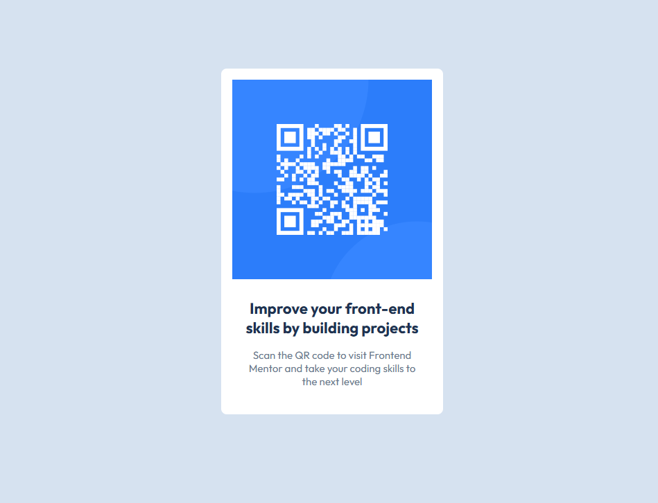

<h1 align="center"> Frontend Mentor - Solução Componente QR Code</h1>

Essa é uma solução para o [Desafio Componente QR Code no Frontend Mentor](https://www.frontendmentor.io/challenges/qr-code-component-iux_sIO_H). Os desafios do Frontend Mentor ajudam você a aprimorar suas habilidades de programação por meio da criação de projetos realistas.

    

## 💻 Projeto

Este projeto é um Componente visual de um QR code

## 🚀 Tecnologias

Esse projeto foi desenvolvido com as seguintes tecnologias:

- HTML
- CSS
- Git e GitHub

### O Que Aprendi

- Organização e Estruturação de HTML semântico
- Uso de variáveis CSS
- Alinhamento com Display Block e Display Flex.

### Links
- Acesse a URL da solução [clicando aqui](https://github.com/Antonio-Rafael-Silva/projeto-qr-component)
- Acesse o site do projeto [clicando aqui](https://antoniorafaeldev.github.io/projeto-qr-component/)

## Screenshot do resultado

### Versão Final

 
    

## Autor

- Website - [Antônio Rafael](https://antonio-rafael-silva.github.io/projeto-qr-component/)
- Frontend Mentor - [@Antonio-Rafael-Silva](https://www.frontendmentor.io/profile/Antonio-Rafael-Silva)
- Linkedin - [Antônio Rafael](https://www.linkedin.com/in/ant%C3%B4nio-rafael-01131b372/)
